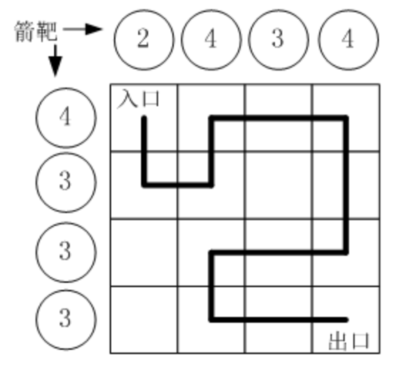

# 蓝桥杯备赛

## DFS
### 路径之谜
#### 题目描述 🌟🌟🌟
小明冒充X星球的骑士，进入了一个奇怪的城堡。
城堡里边什么都没有，只有方形石头铺成的地面。
假设城堡地面是 n x n 个方格。

按习俗，骑士要从西北角走到东南角。
可以横向或纵向移动，但不能斜着走，也不能跳跃。
每走到一个新方格，就要向正北方和正西方各射一箭。
（城堡的西墙和北墙内各有 n 个靶子）

同一个方格只允许经过一次。但不必走完所有的方格。
如果只给出靶子上箭的数目，你能推断出骑士的行走路线吗？
有时是可以的，比如图1.png中的例子。
本题的要求就是已知箭靶数字，求骑士的行走路径（测试数据保证路径唯一）
#### 输入
第一行一个整数N(0<N<20)，表示地面有 N x N 个方格
第二行N个整数，空格分开，表示北边的箭靶上的数字（自西向东）
第三行N个整数，空格分开，表示西边的箭靶上的数字（自北向南）
#### 输出
一行若干个整数，表示骑士路径。
为了方便表示，我们约定每个小格子用一个数字代表，从西北角开始编号: 0,1,2,3…
比如，图1.png中的方块编号为：
0 1 2 3
4 5 6 7
8 9 10 11
12 13 14 15
#### 样例输入
```
4
2 4 3 4
4 3 3 3
```
#### 样例输出
```
0 4 5 1 2 3 7 11 10 9 13 14 15
```
#### 思路
因为保证路径唯一，所以不可能重复访问同一个位置。证明：若重复访问同一个位置，则出现环路，则路径必定不唯一。又因为数据范围比较小，所以直接深搜结束。
#### 代码
```
#include <bits/stdc++.h>
using namespace std;
int n, a[20], b[20], st[20][20], path[400], cnt, ok, ta, tb;
int dx[4] = {0, 1, 0, -1}, dy[4] = {1, 0, -1, 0};
void dfs(int x, int y) {
  if (x < 0 || x >= n || y < 0 || y >= n) return;
  if (st[x][y] || !a[x] || !b[y] || ok) return;
  st[x][y] = 1;
  a[x] --, b[y] --, ta --, tb --;
  path[cnt ++] = x * n + y;
  if (x == n - 1 && y == n - 1 && ta + tb == 0) {
      ok = 1;
      return;
    }
  for (int i = 0; i < 4; i ++) dfs(x + dx[i], y + dy[i]);
  if (ok) return;
  st[x][y] = 0;
  a[x] ++, b[y] ++, ta ++, tb ++;
  cnt --;
}
int main() {
  cin >> n;
  for (int i = 0; i < n; i ++) tb += (cin >> b[i], b[i]);
  for (int i = 0; i < n; i ++) ta += (cin >> a[i], a[i]);
  dfs(0, 0);
  for (int i = 0; i < cnt; i ++) cout << path[i] << ' ';
  return 0;
}
```